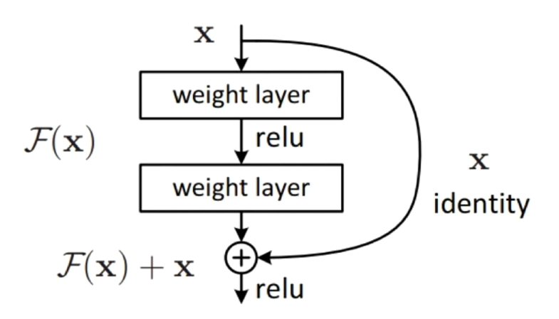
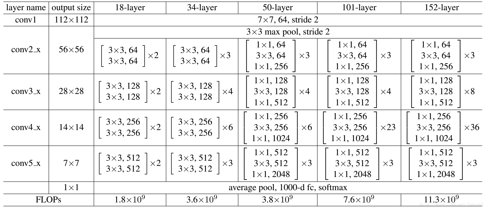
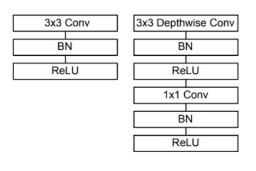
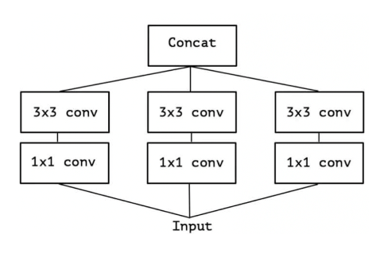

# Image classification
This project contains various CNN for image classification.
## Dataset
cifar-10
## Alex-net

论文：《ImageNet Classification with Deep Convolutional Neural Networks》   
意义：相比传统结构有了更高的分类准确度，引爆深度学习，首次使用Relu。   
结构：2-GPU并行结构；1、2、5卷积层后跟随max-pooling层；两个全连接使用dropout；总共8层神经网络。
## Vgg-net
论文：《Very Deep Convolutional Networks for Large-Scale Image Recognition》    
意义：分类问题第二，物体检测第一(ImageNet2014)。  
结构：更深的网络结构；使用3x3的卷积核和1x1的卷积核；每经过一个pooling层，通道数目翻倍。
两个3x3卷积层视野率等于一个5x5卷积核，多一次线性变换且参数数量降低28%，1x1的卷积核可以看做在对应通道上的非线性变换，有通道降维的作用。  
  
本项目实现的代码基于Cifar数据集，实现了简单层次的vggnet，两次卷积加一个池化层并重复三次并且最后全连接层只实现了一层。
## Res-net 
 
论文：《Deep Residual Learning for Image Recognition》   
意义：ILSVRC2015分类比赛冠军，解决深层次网络训练问题。  
结构：加入恒等变换子结构，identity部分是恒等变换，F(x)为残差学习，学习使得F(x)趋向0，从而忽略深度。  
不同的ResNet有不同结构，如图ResNet-34和ResNet-101是两种常用结构。
   
所有的网络结构可以通用描述为：
* 先用一个步长为2的卷积层。
* 经过一个3x3的max_pooling层
* 经过残差结构
* 没有中间的全连接层，直接到输出。

上图表格中有更多的结构，从各个结构可以看出ResNet强化了卷积层，弱化了全连接层，维持了参数平衡。  
特点：残差结构使得网络需要的学习的知识变少，容易学习；残差结构使得每一层的数据分布接近，容易学习。

代码同样使用Cifer数据集，由于数据集图片较小，所以在输入到残差结构前的卷积层步长设定为1，且没有经过3x3的max_pooling层。
每个残差块都由两个3x3卷积核组成，总共有三个残差层，残差块的个数分别为2、3、2。

## Inception-net
论文：《Rethinking the Inception Architecture for Computer Vision》    
意义：主要是工程的优化，使得同样的参数数量训练更加的效率。一方面解决更深的网络过拟合，另外一方面解决更深的网络有更大计算量的问题。
结构：主要是v1~v4四个结构。

### V1

采用分组卷积，组与组之间的数据在分组计算时候不会交叉。一层上同时使用多种卷积核，看到各层的feature；不同组之间的feature不交叉计算，减少了计算量。
### V2

### V3

### V4

## Mobile-net

## Cnn tricks
### Activation
### Initializer
### Optimizer
### Data augmentation
### Fine tune

