# Image classification
This project contains various CNN for image classification.
## Dataset
cifar-10
## Alex-net

论文：《ImageNet Classification with Deep Convolutional Neural Networks》   
意义：相比传统结构有了更高的分类准确度，引爆深度学习，首次使用Relu。   
结构：2-GPU并行结构；1、2、5卷积层后跟随max-pooling层；两个全连接使用dropout；总共8层神经网络。
## Vgg-net
论文：《Very Deep Convolutional Networks for Large-Scale Image Recognition》    
意义：分类问题第二，物体检测第一(ImageNet2014)。  
结构：更深的网络结构；使用3x3的卷积核和1x1的卷积核；每经过一个pooling层，通道数目翻倍。
两个3x3卷积层视野率等于一个5x5卷积核，多一次线性变换且参数数量降低28%，1x1的卷积核可以看做在对应通道上的非线性变换，有通道降维的作用。  
  
本项目实现的代码基于Cifar数据集，实现了简单层次的vggnet，两次卷积加一个池化层并重复三次并且最后全连接层只实现了一层。
## Res-net 
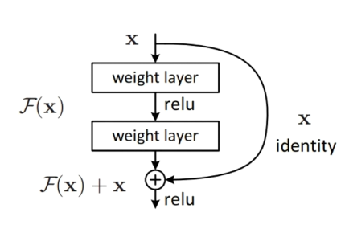   
论文：《Deep Residual Learning for Image Recognition》   
意义：ILSVRC2015分类比赛冠军，解决深层次网络训练问题。  
结构：加入恒等变换子结构，identity部分是恒等变换，F(x)为残差学习，学习使得F(x)趋向0，从而忽略深度。  
不同的ResNet有不同结构，如图ResNet-34和ResNet-101是两种常用结构。
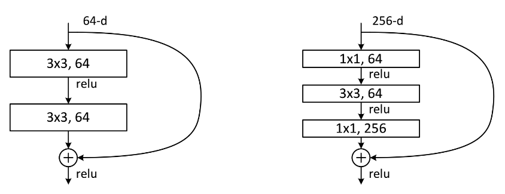     
所有的网络结构可以通用描述为：
* 先用一个步长为2的卷积层。
* 经过一个3x3的max_pooling层
* 经过残差结构
* 没有中间的全连接层，直接到输出。

  
上图表格中有更多的结构，从各个结构可以看出ResNet强化了卷积层，弱化了全连接层，维持了参数平衡。  
特点：残差结构使得网络需要的学习的知识变少，容易学习；残差结构使得每一层的数据分布接近，容易学习。

代码同样使用Cifer数据集，由于数据集图片较小，所以在输入到残差结构前的卷积层步长设定为1，且没有经过3x3的max_pooling层。
每个残差块都由两个3x3卷积核组成，总共有三个残差层，残差块的个数分别为2、3、2。

## Inception-net
论文：《Rethinking the Inception Architecture for Computer Vision》    
意义：主要是工程的优化，使得同样的参数数量训练更加的效率。一方面解决更深的网络过拟合，另外一方面解决更深的网络有更大计算量的问题。  
结构：主要是v1~v4四个结构。  
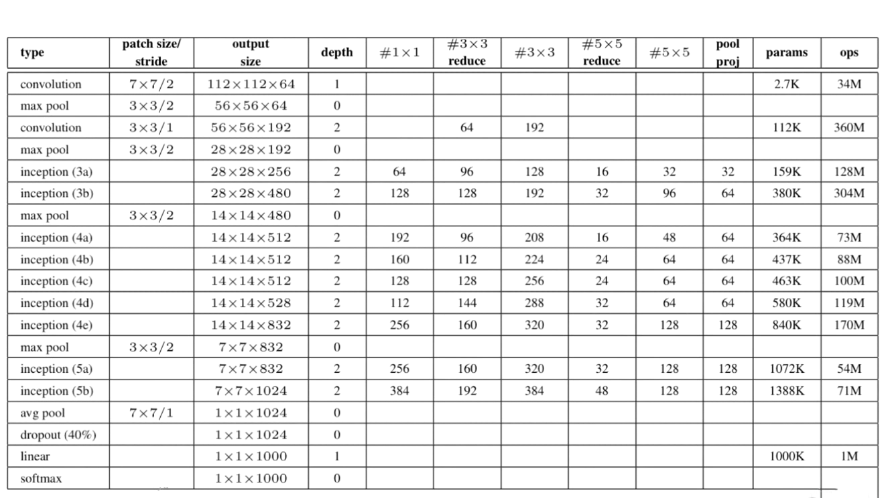
### V1结构
  

  
采用分组卷积，组与组之间的数据在分组计算时候不会交叉。一层上同时使用多种卷积核，看到各层的feature；不同组之间的feature不交叉计算，减少了计算量。
### V2结构  
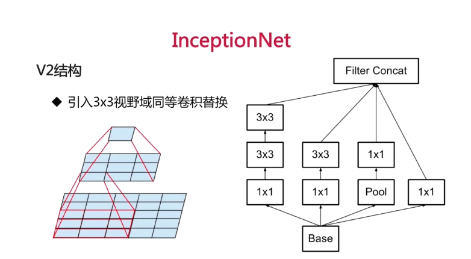  
引入3x3的卷积核做同等卷积替换，两个3x3卷积核的视野域和一个5x5的相同。  
### V3结构  
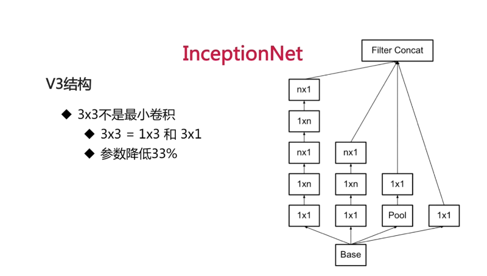  
进一步的做同等卷积替换，一个3x3的卷积核的视野域等同于一个1x3的卷积核加上一个3x1卷积核。  
### V4结构  
  
使用和ResNet同样的思想，引入skip connection，可解决深层次网络训练问题。  

项目中基于v1结构实现了简单的InceptionNet，受限于数据集图片的大小，层次不深，各层的步长和核大小被调整。
结构为conv1(3x3/1)->max_pooling1(2x2/2)->inception_2a->inception_2b->max_pooling2(2x2/2)->inception_3a->inception_3a->max_pooling2(2x2/2)->dense，
每个inception都会增加通道的数目，但是图片的大小维持不变。
## Mobile-net
论文：《MobileNets: Efficient Convolutional Neural Networks for Mobile Vision Applications》   
意义：引入深度可分离的卷积，进一步降低参数。  
  

下图设定输入输出通道数为300，对于一个普通的3x3卷积，它需要3*3*300*300个参数。
若分组卷积，对分组卷积来看它的参数为3*3*100*100*3。参数降低1/3。  
    

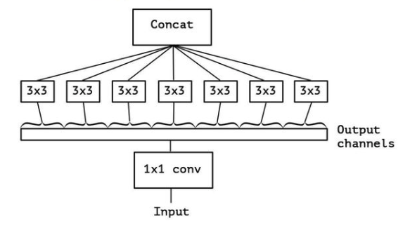    
MobileNet将分组卷积做到极致，如上图所示，每一个3x3卷积核只管一个通道。  
实现和InceptionNet结构差不多，要注意的是在通过深度可分离卷积块的时候(separable_X)，将通道分割开分别送入一个3x3的卷积核，再把它们的输出拼接起来。
## Cnn tricks
### Activation
|激活函数|表达式|特点|图像|
|---|---|---|---|
|Sigmoid||输入非常大或非常小时没有梯度； 输出均值非0； exp计算比较复杂。|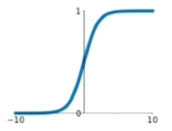|
|Tanh||输入非常大或非常小时没有梯度； 输出均值为0； 计算复杂。|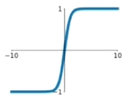|
|ReLU||梯度不会过小； 计算量小； 收敛速度快； 输出均值非0； Dead ReLU:非常大的梯度流过神经元时不会再有激活现象。|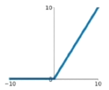|
|Leaky ReLU||解决Dead ReLU问题|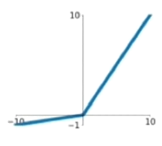|
|ELU||均值更接近于0； 小于0时计算量大。|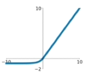|
|Maxout||ReLU泛化版本； 无Dead ReLU； 两倍的参数数量。|---|
### Optimizer
|Optimizer|公式|优缺点|
|---|---|---|
|SGD随机梯度下降| |容易陷入局部极值； 容易陷入saddle point； 选择合适的learning rate比较困难； 每个分量学习率相同。|
|Momentum动量梯度下降| |开始训练时，积累动量，加速训练； 局部极值附近震荡时，梯度为0，由于动量存在，跳出陷阱； 梯度改变方向时，能够缓解震荡。|
|Adagrad|  为约束项|约束项前期较小，放大梯度，后期较大，缩小梯度； 梯度随着训练次数降低； 每个分量有不同的学习率。 学习率设置过大时，约束项过于敏感； 后期，约束项累计太大，会提前结束训练。|
|RMSProp| |适合处理非平稳目标，对于RNN效果很好； 由累积平方梯度变为平均平方梯度； 解决了Adagrad训练后期提前结束的问题。|
|Adam|， ， |Beta1=0.9,Beta2=0.999,learning_rate=e^(-3)； 不同分量有不同学习率； 冲量优势和学习率自适应优势的组合； 善于处理非平稳目标。|
### Data augmentation
### Fine tune

